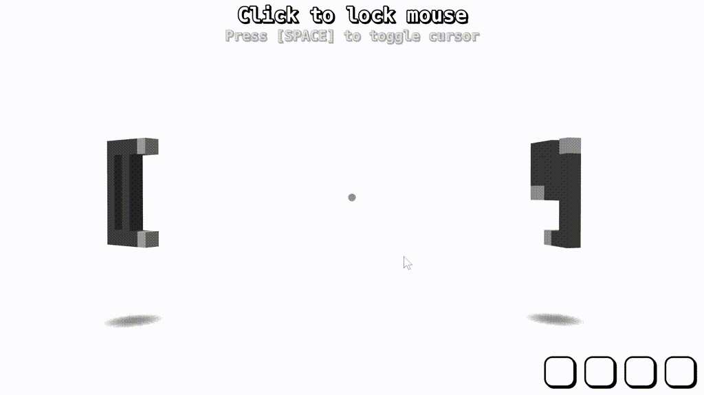

[](https://github.com/indiesoftby/defold-pointer-lock)

# Pointer Lock for Defold

Pointer Lock is intended to simplify mouse locking to access mouse events even when the cursor goes past the boundary of the window or screen. For example, a user can continue to rotate or manipulate a 3D model by moving the mouse without end. Without mouse locking, the rotation or manipulation stops the moment the pointer reaches the edge of the window or screen.

If you want to make a first-person 3D game (DOOM-like, Quake-like etc.) with Defold, then you need this extension.

## Demo

**[Check out the web demo](https://indiesoftby.github.io/defold-pointer-lock/)** to test Pointer Lock on your desktop PC.



## Supported Platforms

| Platform | Status | Known Things |
| -------- | ------ | ------------ |
| Browser (HTML5) | Supported ✅ (Desktop-only!) | The cursor isn't placed in the center of the view when it's locked. The cursor is automatically reset when escape is pressed. |
| macOS | Not Tested ℹ️ | |
| Linux | Not Tested ℹ️ | |
| Windows | Supported ✅ | When the system cursor is locked (`pointer.locked` is `true`), the cursor is placed in the center of the view and cannot be moved. The cursor is invisible in this state. |

## Installation & Usage

You can use it in your own project by adding this project as a [Defold library dependency](http://www.defold.com/manuals/libraries/). Open your `game.project` file and in the dependencies field under project add the ZIP file of a [specific release](https://github.com/indiesoftby/defold-pointer-lock/releases).

Then, add the `pointer_lock/pointer_lock.script` component to the bootstrap collection. Run your game and try to click anywhere to check that the cursor is locked. Press `key_esc` to unlock the cursor.

The `pointer_lock/pointer.lua` module contains the current status:

```lua
-- Is the pointer locked? (read-only)
pointer.locked = false

-- Virtual in-game cursor
pointer.cursor_visible = true
pointer.cursor_x = 0
pointer.cursor_y = 0
```

Pass `on_input` arguments to the `pointer.transform_input` function to convert input data into the virtual in-game cursor system:

```lua
function on_input(self, action_id, action)
    action_id, action = pointer.transform_input(action_id, action)

    -- ...process the input as usual
end
```

The `pointer_lock/cursor_ui.gui` GUI is an example of how to implement a custom virtual in-game cursor.

## License

MIT.

The asset cover uses [an image by Rostislav Uzunov](https://www.pexels.com/photo/purple-and-pink-diamond-on-blue-background-5011647/).
